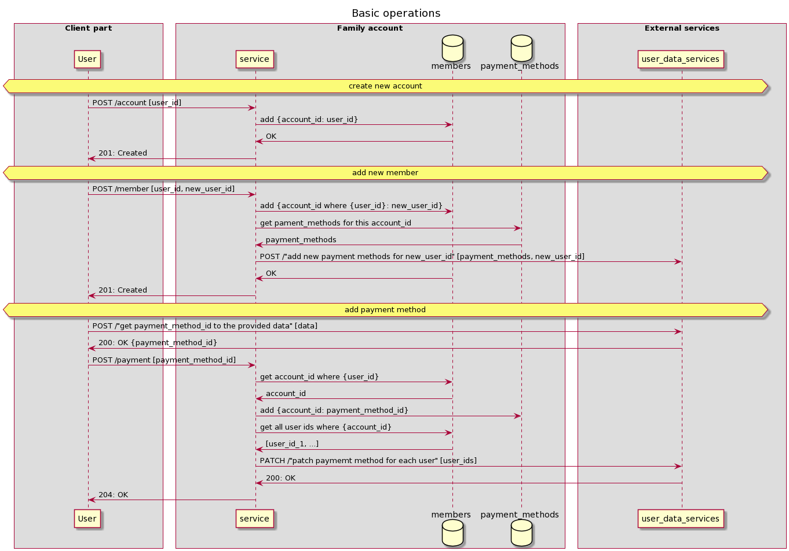
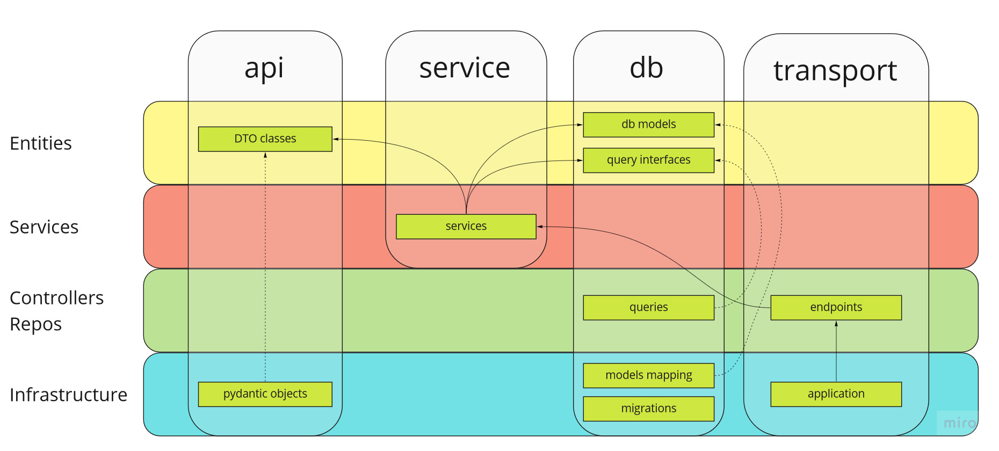

# Family account

repos: https://github.com/Skrillite/familly_account

## Задача

Общий способ оплаты для нескольких аккаунтов

### Функционал

- Создание / удаление группы
- CRUD участников группы
- CRUD способов оплаты

### Логика основных операций

### Подзадачи

- Проектирование сервиса; описание бизнес-логики
- Описание и кодирование DTO и бд схем
- Кодирование бизнес логики
- Кодирование внешних зависимостей, контроллера и репозитория
- Конфигурация приложения и инфраструктуры
- Тестирование

### Архитектура
При разработке фичи я пытался применить чистую архитектуру

На диаграмме по вертикали изображены модули, по горизонтали слои.

Основная логика приложения описана в модуле service. Для упрощения передачи зависимостей
используется класс DI в котором описаны интерфейсы внешних слоев. Он создается на этапе конфигурации
и прокидывается через контроллеры в services.

В роли контроллера в приложении выступают ручки. Они описаны в transport.endpoints. В них происходит
валидация и далее данные передаются в services
