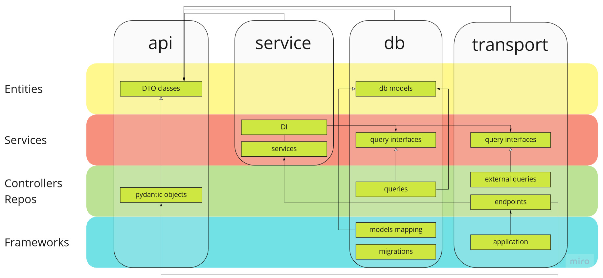

# Family account
## Задача

Общий способ оплаты для нескольких аккаунтов

### Функционал

- Создание / удаление группы
- CRUD участников группы
- CRUD способов оплаты

### Подзадачи

### Архитектура
При разработке фичи я пытался применить чистую архитектуру. Скорее всего, для 
настолько небольшего приложения в этом не было смысла, но я хотел разобраться 

сплошная линия - связи модулей  
пунктирная - соответсвия модулей между слоями 

На диаграмме по вертикали изображены модули, по горизонтали слои.
В слое 

Роль контроллера в приложении исполняет модуль endpoints. Он проксирует запросы в service, где
описана логика сервиса.

На этапе конфигурации приложения создается контекстная переменная с экземпляром
класса DI, где указываются отображения из слоя Entities во внешние.